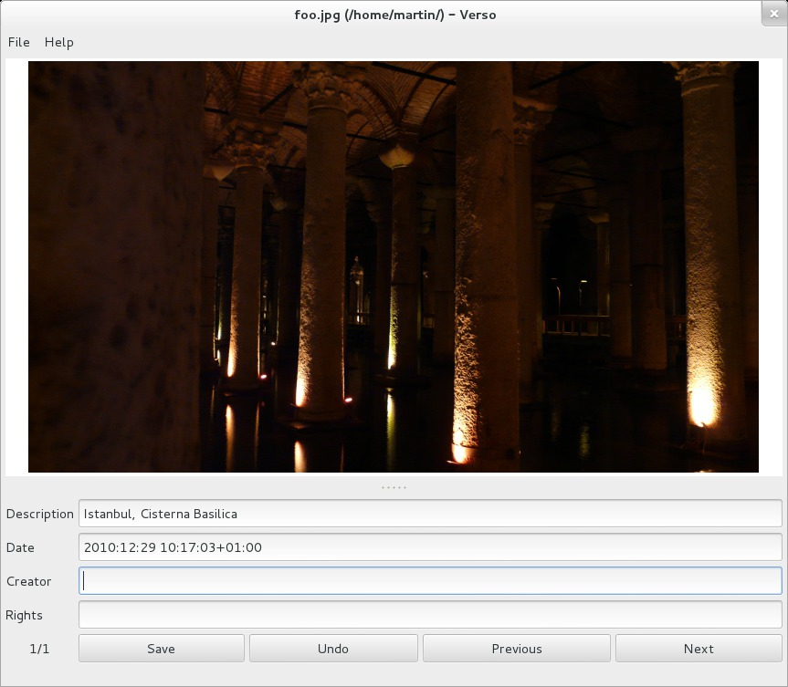

# Verso

## A simple XMP metadata editor for JPEG images

Verso is a tool for editing image metadata embedded in JPEG files. Metadata
can be used e.g. to describe the image's content, the depicted persons, items
and location, to provide information about the date and circumstances of its
creation and to state its creator and any rights/license information.

Metadata created with Verso is structured with [Dublin Core] [DC] elements and
stored in [XMP format] [XMP] inside the JPEG files. (There is no support for
editing EXIF or IPTC metadata!)

Verso is written in Perl and features a Gtk3 GUI. Metadata editing is based on
[Phil Harvey's ExifTool] [ET].

[DC]: http://dublincore.org
[XMP]: https://en.wikipedia.org/wiki/Extensible_Metadata_Platform
[ET]: http://www.sno.phy.queensu.ca/~phil/exiftool/

## Status

The program is not completely finished yet (see the TODO items below), but it
can already be used to work with image metadata.

## Installation

You will need Perl (minimum version 5.10) and the following non-core modules:

* Image::ExifTool
* Gtk3
* List::MoreUtils

If these prerequisites are met, just execute the `verso.pl` file. For
additional comfort you might consider putting it somewhere in your path (and
maybe renaming it), e.g. `~/bin/verso` or `/opt/verso`. Then start it with:

    $ verso path/to/imagedirectory

## What about the name?

[Recto and verso] [RV] are the "front" and "back" sides of a leaf of paper.
The metadata that can be edited with Verso is the same one might have written
on the back (aka verso) side of a photo, back in the olden days of non-digital
photography.

[RV]: https://en.wikipedia.org/wiki/Recto_and_verso

## TODO

* Figure out how to scale and maybe auto rotate images in Gtk3 so they fit in
  the program window. (If anybody knows how to do this - please let me know!)

* Enable the file opening menu.

* Make metadata fields (and other stuff) configurable via a config file and/or
  a GUI menu instead of modifying the source code (although this is quite
  easy).

* Write some more documentation (perldoc/man).

## License

Copyright 2013 Martin Hoppenheit <martin.hoppenheit@brhf.de>

This program is free software: you can redistribute it and/or modify it under
the terms of the GNU General Public License as published by the Free Software
Foundation, either version 3 of the License, or (at your option) any later
version.

This program is distributed in the hope that it will be useful, but WITHOUT
ANY WARRANTY; without even the implied warranty of MERCHANTABILITY or FITNESS
FOR A PARTICULAR PURPOSE.  See the GNU General Public License for more
details.

You should have received a copy of the GNU General Public License along with
this program.  If not, see <http://www.gnu.org/licenses/>.
